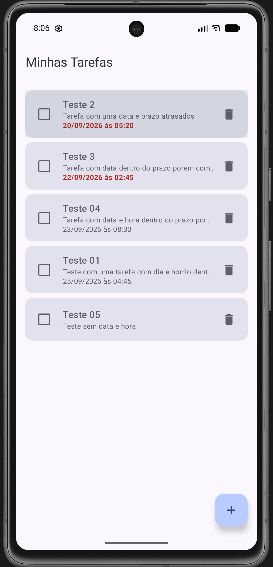
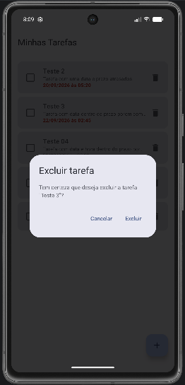
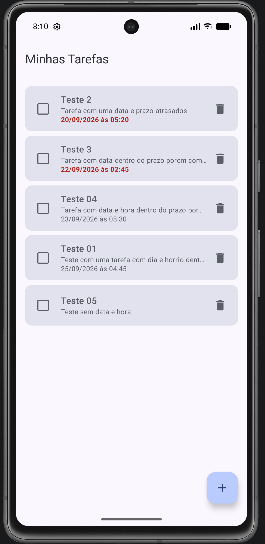
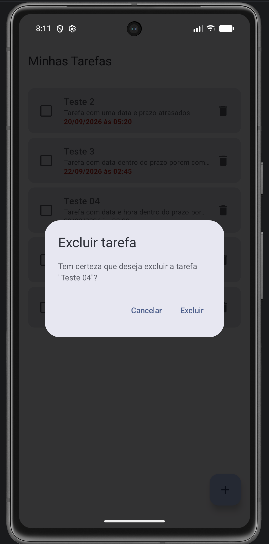
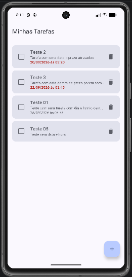

# Evidências da confirmação de exclusão

Este documento apresenta as evidências de funcionamento da confirmação pré-exclusão de tarefas.

As imagens foram registradas durante a execução da aplicação no emulador Android e demonstram, em sequência, o comportamento da funcionalidade.

---

## 1. Lista antes da exclusão

A imagem abaixo apresenta a lista de tarefas antes do início do processo de exclusão.

---

## 2. Diálogo aberto com a tarefa selecionada

Ao tocar no ícone de exclusão, é exibido um diálogo de confirmação contendo o título da tarefa selecionada e as opções **Cancelar** e **Excluir**.

---

## 3. Resultado ao cancelar

Ao selecionar a opção **Cancelar**, o diálogo é fechado sem realizar alterações na lista, mantendo a tarefa selecionada.

---

## 4. Nova abertura do diálogo

Ao tocar novamente no ícone de exclusão da tarefa, o diálogo de confirmação é exibido novamente.

---

## 5. Resultado após confirmar a exclusão

Ao selecionar a opção **Excluir**, a tarefa selecionada é removida da lista e o diálogo é fechado.

