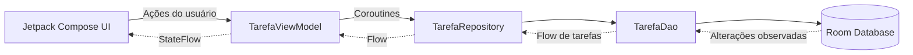
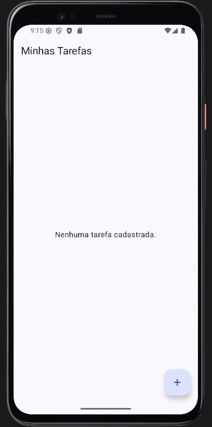
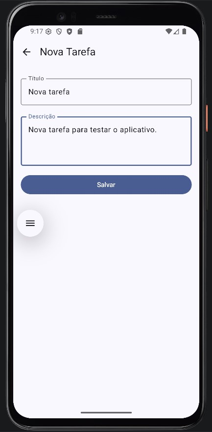
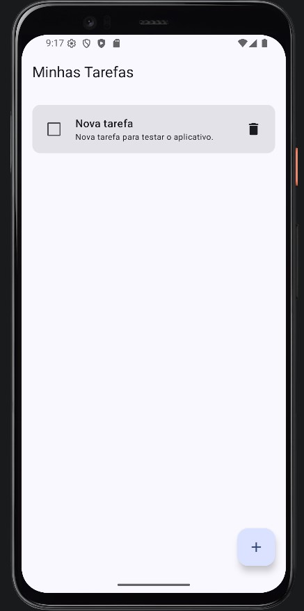
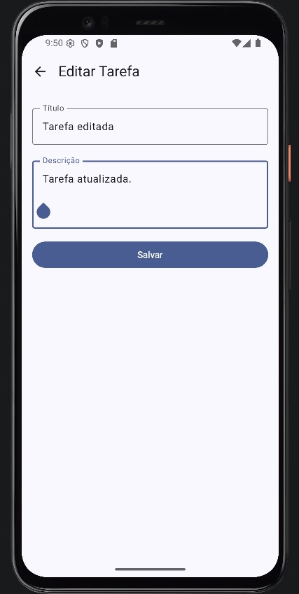
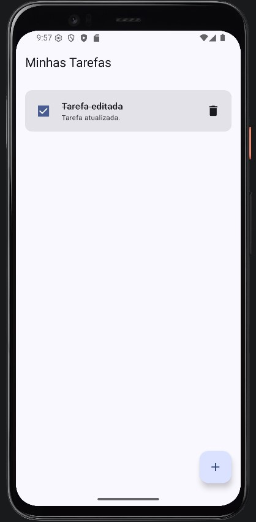
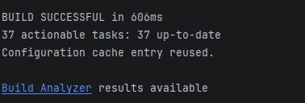

# FIAP To-Do List

> Trabalho acadêmico desenvolvido para a disciplina **Android Kotlin Developer** da FIAP.

| Informação | Detalhe |
|---|---|
| **Aluno** | Lucas Almeida Bel Correa |
| **Turma** | 3SIR - FIAP |
| **Instituição** | FIAP |
| **Professor** | Ewerton Luiz de Lima Carreira |
| **Disciplina** | Android Kotlin Developer |

## Sobre o projeto

O **FIAP To-Do List** é um aplicativo Android nativo para gerenciamento de tarefas pessoais. A aplicação permite cadastrar tarefas, visualizar os registros salvos, editar título e descrição, marcar itens como concluídos e excluir tarefas. Os dados são armazenados localmente com Room, portanto permanecem disponíveis após o fechamento do aplicativo e não dependem de conexão com a internet.

Além de entregar as operações de CRUD, o projeto foi desenvolvido para aplicar uma organização baseada em **MVVM com Repository**, mantendo interface, gerenciamento de estado e persistência em camadas com responsabilidades distintas. A interface foi construída de forma declarativa com Jetpack Compose e reage automaticamente às alterações do banco por meio de Flow e StateFlow.


## Escopo implementado

| Etapa | Commit de referência | Implementação |
|---|---|---|
| Repository e ViewModel | [`80dcd64`](https://github.com/carreiras/to-do-list/commit/80dcd646f67a40501680526730d8e294269287e0) | Criação de `TarefaRepository` e `TarefaViewModel`, com exposição do estado e operações de inserção, atualização e exclusão. |
| Tela de listagem | [`3978a81`](https://github.com/carreiras/to-do-list/commit/3978a8153ce2243d209f7616bacbdcd3bef378ea) | Criação de `ListaTarefasScreen` com `LazyColumn`, estado vazio, conclusão de tarefas, edição, exclusão, cadastro e previews. |
| Formulário | [`0c6c971`](https://github.com/carreiras/to-do-list/commit/0c6c97158f96d8baad44754b420690e05453a5fa) | Criação de `FormularioTarefaScreen` para atender cadastro e edição, com preenchimento dos dados existentes e previews. |
| Navegação | [`cc4f148`](https://github.com/carreiras/to-do-list/commit/cc4f148ccefac47b9f39243d0998812887ad193b) | Configuração de `AppNavigation` com as rotas da lista e do formulário, incluindo o ID da tarefa no caminho. |
| Integração inicial | [`5788686`](https://github.com/carreiras/to-do-list/commit/57886860775559228effea503ef9a705955d72ad) | Substituição da tela de exemplo do template pela criação da ViewModel e inicialização da navegação na `MainActivity`. |

### Funcionalidades disponíveis

- cadastro de tarefa com título obrigatório e descrição opcional;
- listagem reativa das tarefas, ordenadas da mais recente para a mais antiga;
- edição do título e da descrição de uma tarefa existente;
- marcação e desmarcação de uma tarefa como concluída;
- exclusão de tarefas;
- persistência local com Room;
- navegação entre lista e formulário;
- estado visual para lista vazia;
- previews dos principais estados das telas e componentes.

## Tecnologias utilizadas

| Tecnologia | Utilização no projeto |
|---|---|
| **Kotlin** | Linguagem principal utilizada para implementar as camadas de dados, estado, navegação e interface. |
| **Jetpack Compose** | Construção declarativa da interface, utilizando componentes como `Scaffold`, `LazyColumn`, `Card`, `Checkbox`, `OutlinedTextField` e `FloatingActionButton`. |
| **Material 3** | Componentes visuais e estrutura de tema utilizados pelas telas. |
| **Room** | Persistência local das tarefas por meio de Entity, DAO e banco de dados SQLite abstraído pela biblioteca. |
| **Coroutines** | Execução assíncrona das operações suspensas de inserção, atualização e exclusão sem bloquear a interface. |
| **Flow e StateFlow** | Propagação reativa da lista de tarefas desde o DAO até a interface. |
| **ViewModel** | Manutenção do estado da tela e coordenação das ações da interface durante o ciclo de vida da Activity. |
| **Navigation Compose** | Definição das rotas e navegação entre a listagem e o formulário de cadastro ou edição. |
| **KSP** | Processamento das anotações do Room e geração do código necessário para acesso ao banco. |
| **Compose Preview** | Visualização isolada dos estados da interface diretamente no Android Studio. |

### Configuração técnica do projeto

- **Android Gradle Plugin:** 9.1.0
- **Gradle Wrapper:** 9.3.1
- **Kotlin:** 2.2.10
- **Java/JVM:** 21
- **Compile SDK:** 36
- **Target SDK:** 36
- **Minimum SDK:** 24
- **Room:** 2.7.1
- **Navigation Compose:** 2.9.0

## Arquitetura

O aplicativo segue o padrão **MVVM com Repository**. A organização evita que as telas acessem diretamente o banco de dados e estabelece um fluxo previsível para leitura e alteração das tarefas.



O fluxo ocorre em duas direções complementares:

1. **Ações:** a interface encaminha eventos para a ViewModel, que inicia uma coroutine e solicita a operação ao Repository. O Repository delega a chamada ao DAO, que altera o banco Room.
2. **Estado:** quando a tabela é alterada, a consulta observável do DAO emite uma nova lista por `Flow`. A ViewModel converte esse fluxo em `StateFlow`, e as telas coletam o estado de forma compatível com o ciclo de vida. O Compose então recompõe apenas os elementos afetados.

Essa abordagem mantém um fluxo unidirecional de estado: a interface exibe dados recebidos da ViewModel e devolve somente ações do usuário, sem controlar diretamente a persistência.

## Estrutura principal

```text
app/src/main/java/LucasABelCorrea/com/github/todolist/
├── data/
│   ├── Tarefa.kt
│   ├── TarefaDao.kt
│   └── TarefaDatabase.kt
├── repository/
│   └── TarefaRepository.kt
├── viewmodel/
│   └── TarefaViewModel.kt
├── ui/
│   ├── ListaTarefasScreen.kt
│   └── FormularioTarefaScreen.kt
├── navigation/
│   └── AppNavigation.kt
└── MainActivity.kt

docs/
└── evidencias/
    ├── cadastro_nova_tarefa.jpg
    ├── nova_tarefa_cadastrada.jpg
    ├── sucesso_de_build.jpg
    ├── tarefa_concluida.jpg
    └── tela_inicial.jpg
    └── tarefa_editada.jpg
```

## Camada de dados

### `Tarefa`

`Tarefa.kt` representa a entidade persistida na tabela `tarefas`. Cada registro contém:

- `id`: chave primária inteira gerada automaticamente;
- `titulo`: nome da tarefa;
- `descricao`: detalhamento da tarefa;
- `concluida`: estado de conclusão, iniciado como `false`;
- `dataCriacao`: instante de criação utilizado para ordenar a listagem.

O valor `0` do ID também é usado pela navegação como convenção para representar uma tarefa ainda não cadastrada.

### `TarefaDao`

`TarefaDao.kt` define o contrato de acesso ao banco:

- `listarTodas()` retorna `Flow<List<Tarefa>>` e ordena os registros por `dataCriacao DESC`;
- `inserir()` adiciona uma nova tarefa;
- `atualizar()` persiste mudanças em uma tarefa existente;
- `deletar()` remove o registro informado.

As operações de escrita são funções `suspend`, permitindo que sejam executadas por coroutines fora do fluxo principal da interface.

### `TarefaDatabase`

`TarefaDatabase.kt` configura o banco Room na versão 1 e fornece o `TarefaDao`. A instância é criada com o nome `tarefas.db`. O `companion object` utiliza `@Volatile` e `synchronized` como estratégia de acesso compartilhado, centralizando a obtenção do banco durante a execução da aplicação.

## Responsabilidade de `TarefaRepository`

`TarefaRepository` é a camada intermediária entre a ViewModel e o DAO. Sua responsabilidade é fornecer uma API de dados para o restante da aplicação sem expor diretamente os detalhes de implementação do Room.

No estado atual, o Repository é propositalmente simples:

- recebe `TarefaDao` pelo construtor;
- expõe `tarefas: Flow<List<Tarefa>>`, originado pela consulta do DAO;
- delega `inserir`, `atualizar` e `deletar` para o DAO.

Mesmo sendo uma camada fina, essa separação reduz o acoplamento da `TarefaViewModel` com o Room. Caso a fonte de dados mude ou passe a combinar banco local, API, cache ou regras adicionais, essas alterações podem ser concentradas no Repository sem modificar diretamente a interface.

## Responsabilidade de `TarefaViewModel`

`TarefaViewModel` funciona como detentora do estado da interface e como ponto de entrada para as ações relacionadas às tarefas. Ela recebe o `TarefaRepository`, mas não acessa o DAO ou o banco diretamente.

A propriedade `tarefas` é exposta como `StateFlow<List<Tarefa>>`. Para isso, o `Flow` do Repository é convertido por `stateIn` com:

- `viewModelScope` como escopo da coleta;
- `SharingStarted.WhileSubscribed(5_000)` para manter o fluxo ativo durante um curto período após o último observador;
- `emptyList()` como estado inicial enquanto o Room ainda não emitiu a primeira lista.

Os métodos `inserir`, `atualizar` e `deletar` iniciam operações dentro de `viewModelScope.launch`. Dessa forma, as chamadas suspensas do Repository são executadas sem bloquear a thread principal e são canceladas automaticamente quando a ViewModel é descartada.

A ViewModel também fornece uma `ViewModelProvider.Factory`. Essa Factory monta manualmente as dependências na seguinte ordem:

```text
Context → TarefaDatabase → TarefaDao → TarefaRepository → TarefaViewModel
```

Esse mecanismo substitui a necessidade de um framework de injeção de dependência e garante que a ViewModel seja criada pelo sistema com o ciclo de vida correto.

## Como `ListaTarefasScreen` observa o estado e dispara ações

`ListaTarefasScreen` é o Composable conectado à `TarefaViewModel`. A lista é observada por meio de:

```kotlin
val tarefas by viewModel.tarefas.collectAsStateWithLifecycle()
```

`collectAsStateWithLifecycle()` transforma o `StateFlow` em estado do Compose e mantém a coleta associada ao ciclo de vida da tela. Sempre que o Room emitir uma lista atualizada, o Compose recebe o novo valor e recompõe a interface.

A tela conectada delega a renderização para `ListaTarefasContent`, passando a lista e callbacks. Essa separação cria dois níveis:

- **`ListaTarefasScreen`**: componente stateful, responsável por observar a ViewModel e encaminhar ações;
- **`ListaTarefasContent`**: componente orientado por parâmetros, responsável apenas por desenhar o estado recebido e emitir eventos pelas lambdas.

As principais ações são disparadas assim:

- o botão flutuante executa `onNovaTarefa`;
- o toque no card executa `onEditarTarefa(tarefa.id)`;
- o checkbox cria uma cópia com o novo valor de `concluida` e chama `viewModel.atualizar(...)`;
- o ícone de lixeira chama `viewModel.deletar(tarefa)`.

Quando existem tarefas, elas são exibidas por uma `LazyColumn`, que renderiza somente os itens necessários e usa o ID como chave estável. Quando a lista está vazia, a tela apresenta a mensagem `Nenhuma tarefa cadastrada.`.

A divisão entre Screen e Content também viabiliza os previews sem precisar instanciar uma ViewModel ou um banco real. O arquivo contém previews para lista preenchida, lista vazia, item pendente e item concluído.

## Como `FormularioTarefaScreen` diferencia cadastro e edição

`FormularioTarefaScreen` recebe `tarefaId` pela navegação e usa o valor para determinar o modo de funcionamento:

- `tarefaId == 0`: modo de cadastro;
- `tarefaId != 0`: modo de edição.

A tela também observa `viewModel.tarefas` com `collectAsStateWithLifecycle()` e procura a tarefa correspondente ao ID recebido:

```kotlin
val tarefaExistente = remember(tarefas, tarefaId) {
    tarefas.find { it.id == tarefaId }
}
```

No cadastro, os campos começam vazios e, ao salvar, é criada uma nova instância de `Tarefa`. Na edição, título e descrição são preenchidos com os dados existentes. O salvamento utiliza `tarefaExistente.copy(...)`, alterando somente título e descrição e preservando o ID, a situação de conclusão e a data de criação.

`FormularioTarefaContent` mantém os valores digitados com estado local do Compose. O título da barra superior muda entre `Nova Tarefa` e `Editar Tarefa`, o botão Salvar permanece desabilitado quando o título está em branco e os textos são tratados com `trim()` antes do envio.

Após uma inserção ou atualização, `onVoltar()` é chamado para retornar à listagem. A seta da barra superior também executa `onVoltar()`, mas sem salvar alterações.

Assim como na listagem, a separação entre `FormularioTarefaScreen` e `FormularioTarefaContent` permite previews independentes para os modos de nova tarefa e edição.

## Rotas configuradas em `AppNavigation`

`AppNavigation` cria e mantém um `NavController` com `rememberNavController()` e configura um `NavHost` cuja tela inicial é a lista.

| Rota | Destino | Comportamento |
|---|---|---|
| `lista` | `ListaTarefasScreen` | Exibe as tarefas e oferece ações para criar ou editar. |
| `formulario/{tarefaId}` | `FormularioTarefaScreen` | Abre o formulário e entrega o identificador recebido no caminho. |
| `formulario/0` | `FormularioTarefaScreen` | Representa o cadastro de uma nova tarefa. |
| `formulario/<id>` | `FormularioTarefaScreen` | Representa a edição da tarefa cujo ID foi informado. |

Ao selecionar **Nova tarefa**, a aplicação navega para `formulario/0`. Ao tocar em uma tarefa existente, monta a rota `formulario/$id`.

No destino do formulário, o valor de `tarefaId` é lido de `backStackEntry.arguments`, convertido para `Int` e enviado para `FormularioTarefaScreen`. O retorno é feito com `navController.popBackStack()`, removendo o formulário da pilha e reapresentando a lista.

A mesma instância de `TarefaViewModel` é repassada às duas rotas. Com isso, lista e formulário compartilham o mesmo estado e as alterações persistidas são refletidas na listagem quando o usuário retorna.

## Como a `MainActivity` inicia a aplicação

`MainActivity` é o ponto de entrada do aplicativo e atua como raiz de composição das dependências. Em `onCreate`, ela:

1. habilita o desenho edge-to-edge;
2. inicia a árvore Compose com `setContent`;
3. aplica o tema `FiaptodolistTheme`;
4. solicita a criação de `TarefaViewModel` por meio de `viewModel(factory = ...)`;
5. passa a ViewModel para `AppNavigation`.

A Factory recebe `applicationContext`, recupera a instância singleton de `TarefaDatabase`, obtém o DAO, cria o Repository e, por fim, cria a ViewModel. O uso da função `viewModel()` associa essa instância ao ciclo de vida da Activity e evita recriá-la a cada recomposição.

Com essa integração, o conteúdo de exemplo gerado pelo template do Android Studio deixa de ser a tela principal. A aplicação passa a iniciar diretamente no fluxo real de navegação e gerenciamento de tarefas.

## Previews e separação entre estado e apresentação

As telas que dependem de ViewModel foram separadas entre uma função conectada ao estado e uma função de conteúdo. Essa decisão evita a tentativa de criar banco, Context ou ViewModel durante um Preview.

```text
Screen conectada → observa ViewModel e configura callbacks
Content          → recebe dados simples, desenha a UI e pode ser exibida em @Preview
```

Esse padrão melhora a testabilidade visual, reduz o acoplamento dos componentes de apresentação e permite visualizar diferentes cenários no Android Studio sem executar o aplicativo.

## Testes presentes no projeto

O projeto contém testes instrumentados para o `TarefaDao` utilizando um banco Room em memória. Os cenários cobertos verificam:

- inserção e leitura de uma tarefa;
- atualização do estado para concluída;
- exclusão de uma tarefa.

Como o banco é criado em memória durante cada teste e fechado ao final, os testes não alteram os dados da instalação real do aplicativo.

## Como executar

### Pré-requisitos

- Android Studio compatível com o Android Gradle Plugin 9.1.0;
- JDK 21 configurado no Gradle;
- Android SDK Platform 36 instalado;
- emulador ou dispositivo Android com API 24 ou superior.

### Pelo Android Studio

1. Faça o clone ou download deste repositório.
2. Abra no Android Studio a pasta raiz que contém `settings.gradle.kts`.
3. Aguarde a sincronização do Gradle e a instalação das dependências.
4. Confirme que o Gradle está configurado para utilizar o JDK 21.
5. Crie ou inicie um emulador Android, ou conecte um dispositivo físico com depuração USB habilitada.
6. Selecione a configuração do módulo `app`.
7. Clique em **Run** para compilar, instalar e abrir a aplicação.

### Compilação pelo terminal

No Windows:

```powershell
.\gradlew.bat assembleDebug
```

No Linux ou macOS:

```bash
chmod +x gradlew
./gradlew assembleDebug
```

Para executar os testes instrumentados, mantenha um emulador ou dispositivo conectado e utilize:

```powershell
.\gradlew.bat connectedAndroidTest
```

## Evidências

As imagens abaixo estão armazenadas em `docs/evidencias` e registram os principais estados validados durante a atividade.

### Tela inicial e cadastro

| Estado inicial sem tarefas | Formulário de nova tarefa |
|---|---|
|  |  |

A primeira evidência demonstra o estado vazio da `ListaTarefasScreen`. A segunda apresenta o formulário em modo de cadastro, com título e descrição preenchidos.

### Tarefa cadastrada, editada e concluída

| Registro salvo na listagem | Tarefa após edição | Alteração do estado de conclusão |
|---|---|---|
|  |  |  |

Essas evidências demonstram o fluxo de gerenciamento da tarefa: o registro é apresentado na listagem após o cadastro, suas informações podem ser alteradas pelo formulário em modo de edição e seu estado pode ser atualizado para concluído por meio do checkbox. As alterações persistidas são refletidas na interface a partir do estado observado pela aplicação.

### Build do projeto

<p align="center">
  
</p>

A evidência registra a conclusão bem-sucedida do processo de build do projeto.
